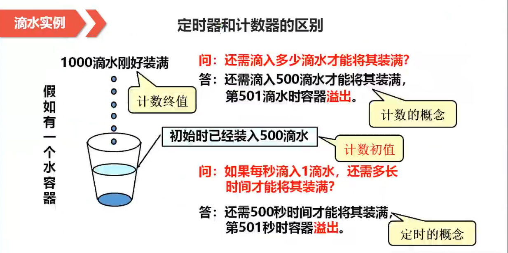
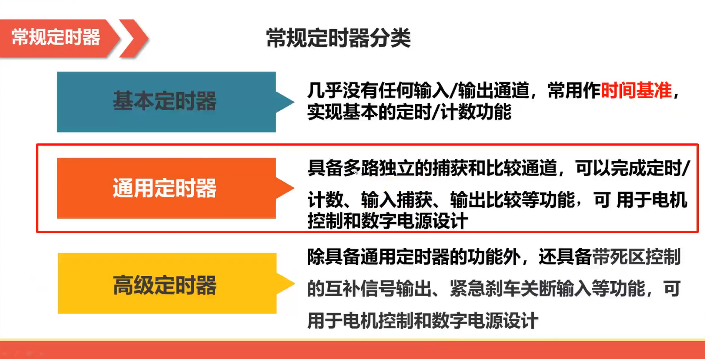
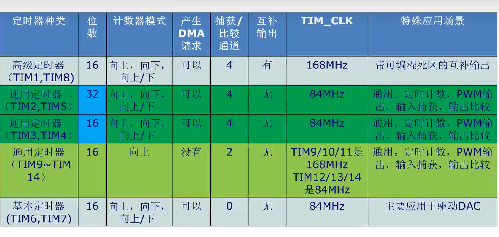

# 基本概念

## 定时器与计数器的区别

**定时器**是对周期固定的脉冲信号进行计数,如MCU内部的外设时钟(APB)。

**计数器**是对周期不确定的脉冲信号进行计数,如MCU的外部I/O引脚所引入的外部脉冲信号。

定时器和计数器本质上都是计数器,定时器是计数器的一种特例。

## 定时器使用所关注的三个问题

1. **位宽**

    定时器的计数范围：16位定时器的最大计数值为 2^16-1, 32位定时器的最大计数值为 2^32-1。

2. **计数值**

    定时器初值的设置。

    定时器终值的设置。

3. **处理**

    定时器溢出以后需要完成的操作,即定时器中断服务函数。

## 定时器的分类

### 常规定时器的分类

